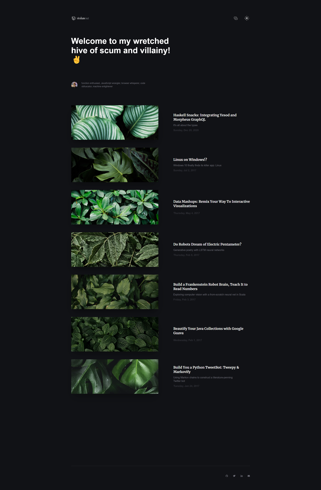

# vivshaw's website, version 2.

This is the second version of my website, launched in 2022. It has a long, troubled history. I originally started work around 2018 after version 1 started getting tought to work with. I decided to use Gatsby, and spent a very long time puttering around with little success. I began by redesigning from scratch , settling on a look based on colorful abstract blobs. That didn't last long. Then, for a while I worked on porting the v1 styles over to v2. That went a little better, but was ultimately unsatisfying. I ultimately settled on using another template, [Narative](https://www.narative.co/)'s now-defunct Novela theme, which I stripped down to just the bits I actualy needed. I also moved from Gatsby to NextJS, which I found drastically easier to work with. I introduced MDX, so I could use JS components in my blog posts. And I adopted TypeScript. I hosted the site on Vercel rather than the old GitHub Pages deployment, which mostly Just Worked. This stack finally got me to a launch in 2022.

# What did it look like?

## Homepage



I stripped away the homepage, projects pages, and about page of V1, and went down to just a blog and blog posts. Much of that stuff felt superfluous, and it felt good to strip it down to something more minimal. Returning elements include the botanical images. The color theme now has dark blue and light yellow tones. And I made myself a cheesy little logo wordmark. I don't like the wordmark much in hindsight- it's somewhat tacky. The removal of the angle-cut background from v1 removed legibility issues in the blog index. I also introduced a light and dark mode.


## Blog Post


The blog post is fairly simple. A notable difference is the code highlight scheme- between v1 and v2, I feel in love with Dracula theme, and I applied it to code highlighting here. I think it really helps the legibility of the code. I also added a fancy progress doohickey on the left, which tracks your scroll progress for through the page. This is neat, but ultimately useless- your browser is already so equipped via the regular scrollbar. I swapped to a sans-serif text font, which I think was a mistake- the overall text legibility of the blogs posts is slightly worse than v1.

# Last thoughts

This was a slog that felt good to get out of the way, but I wasn't ultimately very proud of the result. It refreshed the design, but was also less custom/less "me" than v1. It went more minimal, but it stripped out some things I probably should've kept, like an about page. It both improved and unimproved the blog post layout. It resolved my Jekyll build problems in v1, but added _different_ tooling problems (like some weird image loading jank I never quite resolved) and a more complex stack. The biggest problem of all, was that the design is highly image-focused, but my site is almost entirely text. So I filled it with stock photos of botanicals. Those make me feel nice to look at... but are ultiamtely not relevant to the page in any way, so it feels completely half-baked.

That said, this all needed to happen in order to make the next phase possible. Clearing the hurdle of getting onto Next was big. Exploring the space outside v1 was big. Unlike the lackdaisical tinkering of my early versions gave me a clear direction and purpose for v3, with a functioning base to begin from. And so, I don't feel too bad about this version. It wasn't ultimately what I wanted, but it carried me along to the next phase.

That's it for Version 2! Original readme is as follows:

# Example app with MDX

This example shows using [MDX](https://github.com/mdx-js/mdx) as top level pages for your next.js app.

## Deploy your own

Deploy the example using [Vercel](https://vercel.com?utm_source=github&utm_medium=readme&utm_campaign=next-example) or preview live with [StackBlitz](https://stackblitz.com/github/vercel/next.js/tree/canary/examples/with-mdx)

[](https://vercel.com/new/git/external?repository-url=https://github.com/vercel/next.js/tree/canary/examples/with-mdx&project-name=with-mdx&repository-name=with-mdx)

## How to use

Execute [`create-next-app`](https://github.com/vercel/next.js/tree/canary/packages/create-next-app) with [npm](https://docs.npmjs.com/cli/init), [Yarn](https://yarnpkg.com/lang/en/docs/cli/create/), or [pnpm](https://pnpm.io) to bootstrap the example:

```bash
npx create-next-app --example with-mdx with-mdx-app
```

```bash
yarn create next-app --example with-mdx with-mdx-app
```

```bash
pnpm create next-app --example with-mdx with-mdx-app
```

Deploy it to the cloud with [Vercel](https://vercel.com/new?utm_source=github&utm_medium=readme&utm_campaign=next-example) ([Documentation](https://nextjs.org/docs/deployment)).

## TODO

 - [ ] There's an error with `'` and `"` in Prism code blocks of unknown language
 - [ ] Make `code` blocks more legible
 - [ ] Unscrew Copy button in fenced code blocks (it scrolls with the block for some reason)
 - [ ] Figure out what the heck is controlling scrolling in fenced code blocks
 - [ ] Nicer component for loading images in MDX?
 - [ ] Actual dev env support for MDX
 - [ ] Rip out Emotion / ThemeUI in favor of Stitches / Radix
 - [ ] Tighten up types in general
 - [ ] Line numbers
 - [ ] Highlights
 - [ ] CLI styles
 - [ ] Figure out what to do with back button in navbar / routing stuff
 - [ ] Fix socials icons on phone screens
 - [ ] Fix top of screen being white on phone
 - [ ] Actually display/use the category tags
 - [ ] Get "Next Article" working for real
 - [ ] type meta, if possible
 - [ ] Yarn PnP support? (Not compatible with Turborepo... yet!)
 - [ ] Monorepo it? (Turborepo? NX?)
 - [ ] Storybook
 - [ ] Fix Data Mashups url
 - [ ] tidy MDX components generally
 - [ ] figure out why `srcset` isn't working right, then use it, and fix any other image perf issues
 - [ ] Should social tags have a published _time_ as well as date?
