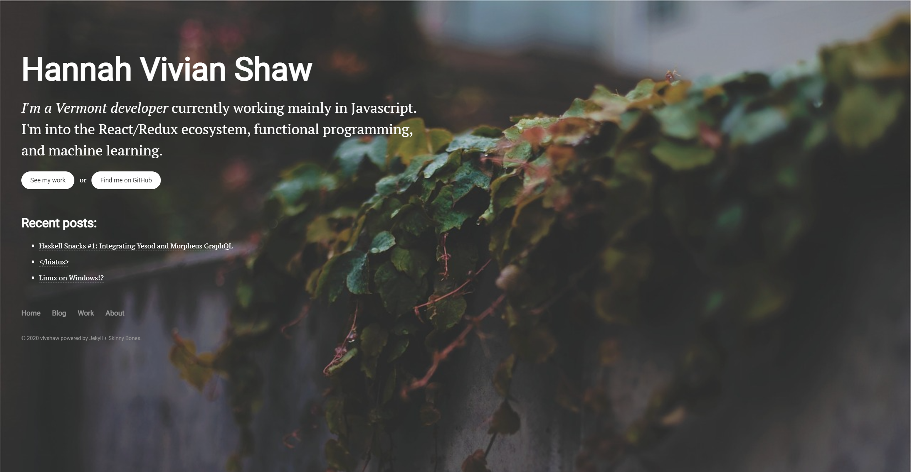
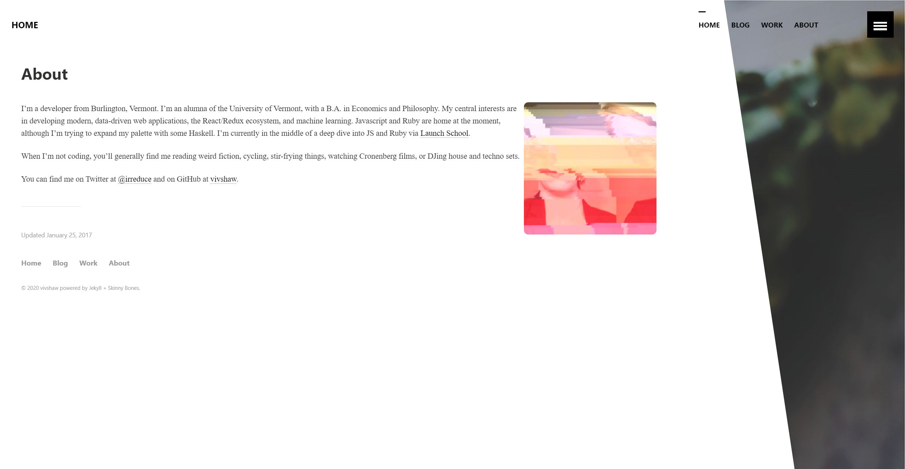
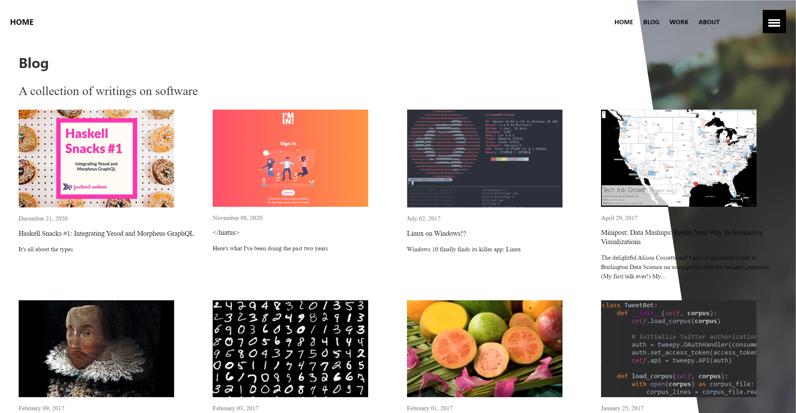

# vivshaw's website, version 1.

This was the original version of my website, which I put up back in Spring of 2017. It was hosted at https://vivshaw.github.io. It was built with Jekyll, using the Skinny Bones theme by the excellent [Michael Rose/mademistakes](https://mademistakes.com/). I customized it a fair bit to add details that were to my taste at the time- a botanical image with soothing dark earth tones and shallow-focus photography, an angular background cutout, a fancy landing page, and other such things. This humble page launched my career and kept me going for a long time, and I'll be thankful for that for a long time.

As I customized it, it eventually stopped being automagically buildable by GitHub Pages. This proved to be the death knell, as the extra hoops of juggling branches, building locally, and pushing the build result added enough inertia that I stopped updating regularly. (GitHub actions didn't exist back then, and I didn't know about CI/CD anyways.) Eventually, in 2022 I went back and revived my site with a from-scratch build as [version 2](https://github.com/vivshaw/vivshaw.net/tree/v2).

# What did it look like?

## Homepage

I loved the heck out of this homepage. The big botanical image feels very comfy. I still like looking back at this one- it was a bit of a shame to take it down. It's not obvious from the static image, but the links have a nice little hover effect.

## About

Here you can see the angled background cut, through which the botanical cover image shows. I thought that was so neat. Y'know- it _is_ kinda neat. And my glitch-art profile pic- I was very self-conscious and didn't like photos, so this was the closest to a real profile pic you could get out of me.

## Blog

Here's the blog. You can see the flaw of the angled background cut here- the right column of posts are highly illegible on narrow monitors.

## Blog Post

The blog posts are actually pretty decent! It's really legible, and it has a touch of character. The syntax highlighting is bad though- it's pretty hard to read the code. And the TOC could use work.

# Last thoughts

This was a landmark for me. Though it was built from a Jekyll template, I invested a lot of effort into customizing, and it paid off. It was my first time flexing my design muscles and playing around with the possibilities of frontend, and I was happy with what I created.

I think there were many legitimate flaws, though. The hamburger menu was totally stock, and looked pretty meh. (Plus, does it really _need_ that menu?) The angled-cut look is neat, but really messed up legibility in certain screens, and hampered my ability to use that space effectively. The style got old too. But more important than the visual problems were technical ones! The page stopped building on Github Pages, so it became a hassle to update. It was hard to integrate the frontendy, JavaScripty stuff I wanted to do with Jekyll's build-time, Ruby world.

Problems aside, I think there were some things this first version did better than later ones! The blog posts were more legible than Version 2, and the homepage still makes me smile in a way later versions don't. So, I feel pretty good about what I accomplished. 

That's it for version 1! Original README is as follows:

# vivshaw.github.io

just a little Jekyll blog

originally based on mmistakes' [Skinny Bones](https://github.com/mmistakes/skinny-bones-jekyll)
