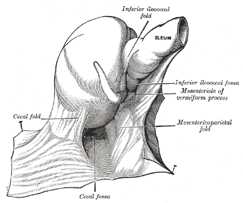

## Technical matters

For technical details and the complete source code, see [GitHub](https://github.com/vivshaw/vivshaw.github.io).

## Typography

I use [MB Type](https://mbtype.com/)'s [Equity](https://mbtype.com/fonts/equity/) for serif text and [Concourse](https://mbtype.com/fonts/concourse/) for sans-serif.

## Ileum

Most websites have at most a colophon, but mine also has an ileum. This makes it better than your website. Future upgrades may introduce the rest of the digestive tract.

